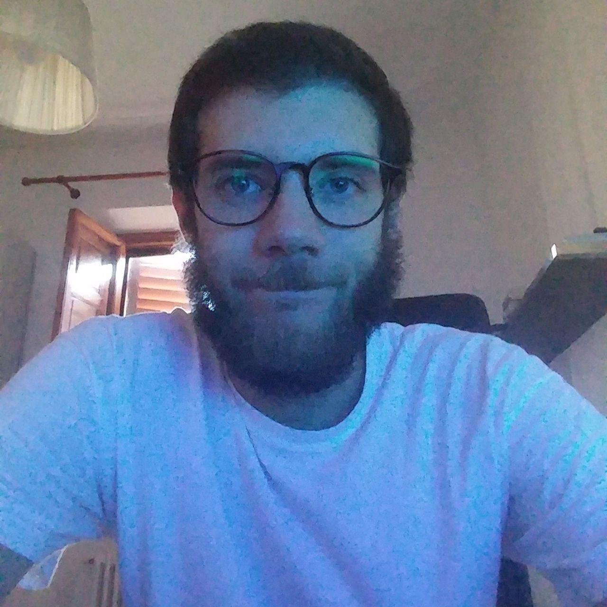

# Studenti anno 2 - 2019/2020

|   | Nome | Corso | Team | Url |
|---|---|---|---|---|
| | Guido Fabbri | Game Design | 3| [github.com/Yathsy](https://github.com/Yathsy)
| | Antonio Cecchi | Game Design | 2 | [github.com/AntonioCecchi](https://github.com/AntonioCecchi) [antoniocecchi.github.io](https://antoniocecchi.github.io)
| | Riccardo Corsi | Programming | 2 | [github.com/CorsiRiccardo](https://github.com/CorsiRiccardo)
| | Andrea Agostini | Programming | 3 | [github.com/Ago251](https://github.com/Ago251)
| | Kirill Scalirò | Concept Art | 2 | [github.com/hariseldon06](https://github.com/hariseldon06)
| | Andrea Sala | Game Design |  | [github.com/SalaAndrea](https://github.com/SalaAndrea) [salaandrea.github.io](https://salaandrea.github.io/)
| | Piefrancesco Catalano | Game Design |  | [github.com/PierfrancescoCatalano](https://github.com/PierfrancescoCatalano) [pierfrancescocatalano.github.io](https://pierfrancescocatalano.github.io)
| | Jacopo Innocenti | Programming | 3 | [github.com/InnoLeggenda](https://github.com/InnoLeggenda)
| | Francesco Visco | Game Design | 4 | [github.com/FrancescoVisco](https://github.com/FrancescoVisco) [francescovisco.github.io](https://francescovisco.github.io/)
