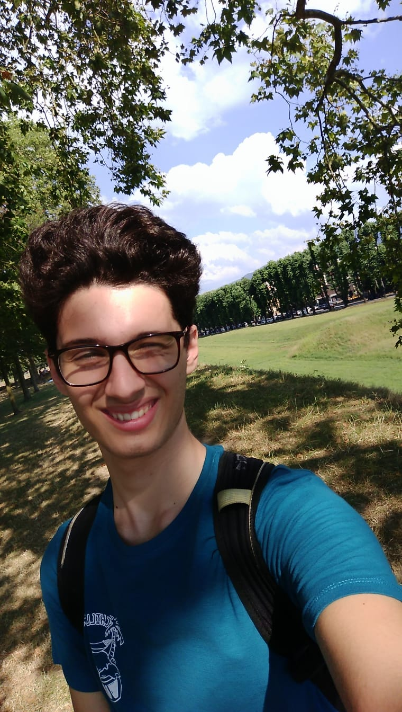
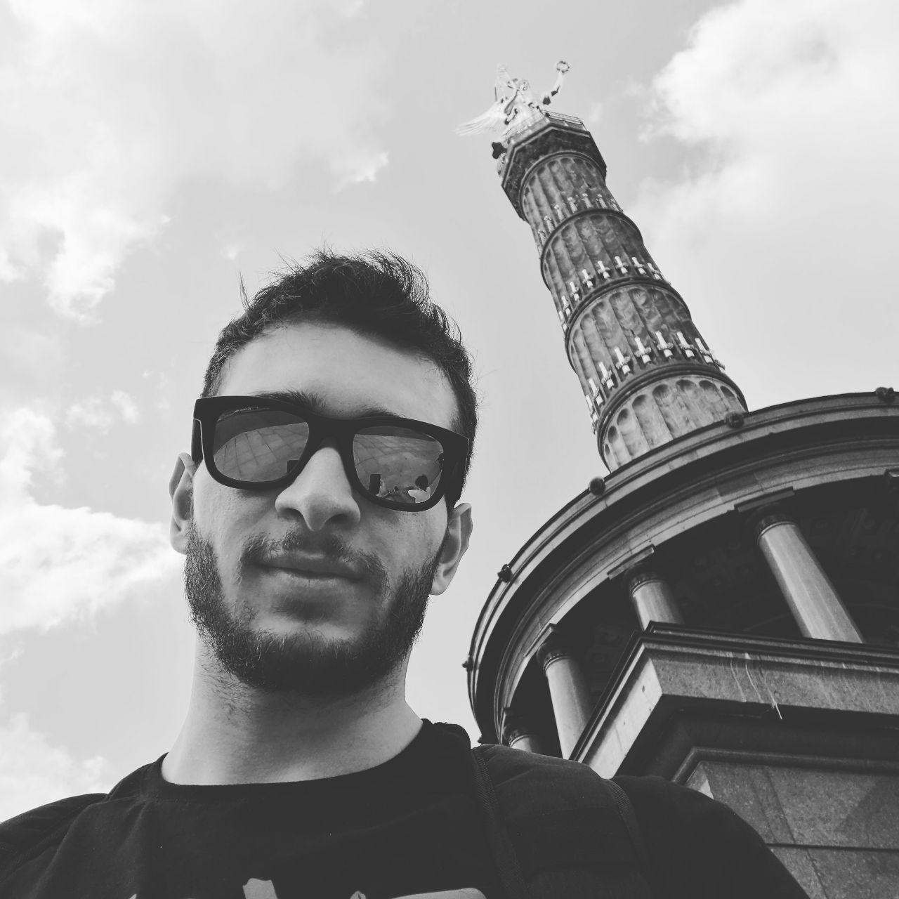
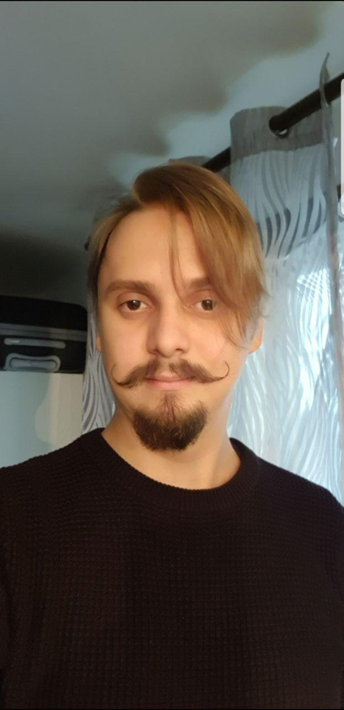

# Studenti anno 2 - 2019/2020

|   | Nome | Corso | Team | GitHub | Website |
|---|---|---|---|---|---|
| | Guido Fabbri | Game Design | 3| [Yathsy](https://github.com/Yathsy) |
| | Antonio Cecchi | Game Design | 2 | [AntonioCecchi](https://github.com/AntonioCecchi) | [antoniocecchi.github.io](https://antoniocecchi.github.io)
| | Riccardo Corsi | Programming | 2 | [CorsiRiccardo](https://github.com/CorsiRiccardo) |
| | Andrea Agostini | Programming | 3 | [Ago251](https://github.com/Ago251) |
| | Kirill Scalirò | Concept Art | 2 | [hariseldon06](https://github.com/hariseldon06) |
